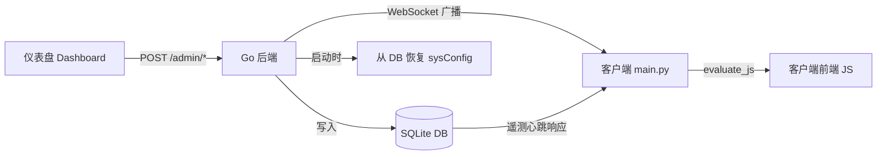

# 两期更新完整清单与原理

## 整体架构原理

**核心数据流**：仪表盘编辑 → Go 后端 API → SQLite 持久化 → 客户端遥测心跳时随响应下发 → [main.py](file:///g:/PychormWenJian/AimerWT/20260311/main.py) 接收并通过 `evaluate_js` 覆盖前端运行时数据。

---

## 第一期：配置持久化 + 广告轮播管理

### 解决的问题
1. **sysConfig 重启丢失**：所有 alert/notice/update 配置存在内存中，Go 进程重启即归零
2. **广告轮播无法远程管理**：客户端左上角 3 张图片的 URL、跳转链接全部硬编码在 [ad_carousel_config.js](file:///g:/PychormWenJian/AimerWT/20260311/web/ads/ad_carousel_config.js)

### 修改文件清单

| # | 文件 | 操作 | 改动说明 |
|---|------|------|---------|
| 1 | [content_config.go](file:///g:/PychormWenJian/AimerWT/20260311/AimerWT_Telemetry/content_config.go) | **新建** | 配置持久化层，提供 [SaveConfig](file:///g:/PychormWenJian/AimerWT/20260311/AimerWT_Telemetry/content_config.go#13-20)/[LoadConfig](file:///g:/PychormWenJian/AimerWT/20260311/AimerWT_Telemetry/content_config.go#21-32) KV 读写 + [PersistSysConfig](file:///g:/PychormWenJian/AimerWT/20260311/AimerWT_Telemetry/content_config.go#47-56)/[RestoreSysConfig](file:///g:/PychormWenJian/AimerWT/20260311/AimerWT_Telemetry/content_config.go#57-70) 序列化函数 + [SaveAdCarouselItems](file:///g:/PychormWenJian/AimerWT/20260311/AimerWT_Telemetry/content_config.go#71-80)/[LoadAdCarouselItems](file:///g:/PychormWenJian/AimerWT/20260311/AimerWT_Telemetry/content_config.go#81-94) 广告数据读写 |
| 2 | [models.go](file:///g:/PychormWenJian/AimerWT/20260311/AimerWT_Telemetry/models.go) | 修改 | 新增 [ContentConfig](file:///g:/PychormWenJian/AimerWT/20260311/AimerWT_Telemetry/models.go#70-75) 表模型（KV 持久化）+ [AdCarouselItem](file:///g:/PychormWenJian/AimerWT/20260311/AimerWT_Telemetry/models.go#77-83) 数据结构 |
| 3 | [main.go](file:///g:/PychormWenJian/AimerWT/20260311/AimerWT_Telemetry/main.go) | 修改 | `AutoMigrate` 加入 [ContentConfig](file:///g:/PychormWenJian/AimerWT/20260311/AimerWT_Telemetry/models.go#70-75) + 启动时调用 [RestoreSysConfig()](file:///g:/PychormWenJian/AimerWT/20260311/AimerWT_Telemetry/content_config.go#57-70) |
| 4 | [router.go](file:///g:/PychormWenJian/AimerWT/20260311/AimerWT_Telemetry/router.go) | 修改 | ① `/admin/control` 执行后调用 [PersistSysConfig()](file:///g:/PychormWenJian/AimerWT/20260311/AimerWT_Telemetry/content_config.go#47-56) 写入 DB ② 新增 `GET/POST /admin/ad-carousel` API ③ `/telemetry` 响应中追加 `ad_carousel_items` 字段 |
| 5 | [advertisement.html](file:///g:/PychormWenJian/AimerWT/20260311/AimerWT_Telemetry/dashboard/views/advertisement.html) | **重写** | 从占位页变为完整广告轮播管理页（列表展示、编辑表单、轮播间隔配置、接入说明） |
| 6 | [app.js](file:///g:/PychormWenJian/AimerWT/20260311/AimerWT_Telemetry/dashboard/js/app.js) | 修改 | [initView](file:///g:/PychormWenJian/AimerWT/20260311/AimerWT_Telemetry/dashboard/js/app.js#210-240) 中加入 `advertisement` case + 新增 [initAdvertisement](file:///g:/PychormWenJian/AimerWT/20260311/AimerWT_Telemetry/dashboard/js/app.js#1607-1612)/[loadAdCarousel](file:///g:/PychormWenJian/AimerWT/20260311/AimerWT_Telemetry/dashboard/js/app.js#1613-1628)/[renderAdList](file:///g:/PychormWenJian/AimerWT/20260311/AimerWT_Telemetry/dashboard/js/app.js#1629-1656)/[addAdItem](file:///g:/PychormWenJian/AimerWT/20260311/AimerWT_Telemetry/dashboard/js/app.js#1663-1676)/[editAdItem](file:///g:/PychormWenJian/AimerWT/20260311/AimerWT_Telemetry/dashboard/js/app.js#1677-1692)/[saveAdItem](file:///g:/PychormWenJian/AimerWT/20260311/AimerWT_Telemetry/dashboard/js/app.js#1708-1725)/[deleteAdItem](file:///g:/PychormWenJian/AimerWT/20260311/AimerWT_Telemetry/dashboard/js/app.js#1726-1732)/[moveAdItem](file:///g:/PychormWenJian/AimerWT/20260311/AimerWT_Telemetry/dashboard/js/app.js#1733-1741)/[saveAdCarouselAll](file:///g:/PychormWenJian/AimerWT/20260311/AimerWT_Telemetry/dashboard/js/app.js#1742-1758) 等方法 |
| 7 | [telemetry_manager.py](file:///g:/PychormWenJian/AimerWT/20260311/services/telemetry_manager.py) | 修改 | `_msg_callback` 调用前将 `data["ad_carousel_items"]` 合并到 `sys_config` dict 中 |
| 8 | [main.py](file:///g:/PychormWenJian/AimerWT/20260311/main.py) | 修改 | [on_server_message](file:///g:/PychormWenJian/AimerWT/20260311/main.py#352-442) 中新增第5段：接收 `ad_carousel_items` → 覆盖 `window.AIMER_AD_CAROUSEL_CONFIG.items` |

### 原理详解

**配置持久化**：
- [ContentConfig](file:///g:/PychormWenJian/AimerWT/20260311/AimerWT_Telemetry/models.go#70-75) 表是一个简单的 KV 表（key VARCHAR + value TEXT + updated_at）
- 每次 `/admin/control` 成功执行后，[PersistSysConfig()](file:///g:/PychormWenJian/AimerWT/20260311/AimerWT_Telemetry/content_config.go#47-56) 将整个 `sysConfig` JSON 序列化后写入 key=`sys_config` 的记录
- Go 进程启动时 [RestoreSysConfig()](file:///g:/PychormWenJian/AimerWT/20260311/AimerWT_Telemetry/content_config.go#57-70) 从 DB 读取并反序列化恢复，确保重启不丢配置

**广告轮播远程管理**：
- 仪表盘通过 `POST /admin/ad-carousel` 将广告项列表 JSON 写入 [ContentConfig](file:///g:/PychormWenJian/AimerWT/20260311/AimerWT_Telemetry/models.go#70-75) 表（key=`ad_carousel_items`）
- 客户端每次遥测心跳 `POST /telemetry` 时，后端从 DB 读取广告数据附在响应中
- [telemetry_manager.py](file:///g:/PychormWenJian/AimerWT/20260311/services/telemetry_manager.py) 将 `ad_carousel_items` 合并到 `sys_config` dict 传给 [on_server_message](file:///g:/PychormWenJian/AimerWT/20260311/main.py#352-442)
- [main.py](file:///g:/PychormWenJian/AimerWT/20260311/main.py) 接收后通过 `evaluate_js` 覆盖 `window.AIMER_AD_CAROUSEL_CONFIG.items`，客户端轮播模块下次初始化时自动使用新数据

---

## 第二期：公告列表 CRUD + 远程管理

### 解决的问题
1. **往期动态公告**硬编码在 [notice_data.js](file:///g:/PychormWenJian/AimerWT/20260311/web/js/notice/notice_data.js)，无法远程增删改查
2. **置顶公告**的 `isPinned` 写死在本地，无法远程设置
3. **公告类型/标签**无法远程管理

### 修改文件清单

| # | 文件 | 操作 | 改动说明 |
|---|------|------|---------|
| 1 | [models.go](file:///g:/PychormWenJian/AimerWT/20260311/AimerWT_Telemetry/models.go) | 修改 | 新增 [NoticeItem](file:///g:/PychormWenJian/AimerWT/20260311/AimerWT_Telemetry/models.go#85-98) 表模型（id/type/tag/title/summary/content/date/is_pinned/sort_order/created_at/updated_at） |
| 2 | [main.go](file:///g:/PychormWenJian/AimerWT/20260311/AimerWT_Telemetry/main.go) | 修改 | `AutoMigrate` 加入 [NoticeItem](file:///g:/PychormWenJian/AimerWT/20260311/AimerWT_Telemetry/models.go#85-98) |
| 3 | [router.go](file:///g:/PychormWenJian/AimerWT/20260311/AimerWT_Telemetry/router.go) | 修改 | ① 新增 `GET /admin/notices` 列表查询 ② `POST /admin/notices` 新建（含置顶互斥） ③ `PUT /admin/notices/:id` 编辑 ④ `DELETE /admin/notices/:id` 删除 ⑤ `/telemetry` 响应中追加 `notice_items` |
| 4 | [announcement.html](file:///g:/PychormWenJian/AimerWT/20260311/AimerWT_Telemetry/dashboard/views/announcement.html) | 修改 | 底部新增全宽"公告列表管理"区域（列表面板 + 编辑表单面板，含类型选择、标题、日期、摘要、内容、置顶勾选框） |
| 5 | [app.js](file:///g:/PychormWenJian/AimerWT/20260311/AimerWT_Telemetry/dashboard/js/app.js) | 修改 | [initAnnouncement](file:///g:/PychormWenJian/AimerWT/20260311/AimerWT_Telemetry/dashboard/js/app.js#1378-1385) 加入 [loadNoticeList()](file:///g:/PychormWenJian/AimerWT/20260311/AimerWT_Telemetry/dashboard/js/app.js#1471-1484) + 新增 [loadNoticeList](file:///g:/PychormWenJian/AimerWT/20260311/AimerWT_Telemetry/dashboard/js/app.js#1471-1484)/[renderNoticeList](file:///g:/PychormWenJian/AimerWT/20260311/AimerWT_Telemetry/dashboard/js/app.js#1485-1507)/[addNoticeItem](file:///g:/PychormWenJian/AimerWT/20260311/AimerWT_Telemetry/dashboard/js/app.js#1508-1525)/[editNoticeItem](file:///g:/PychormWenJian/AimerWT/20260311/AimerWT_Telemetry/dashboard/js/app.js#1526-1545)/[saveNoticeItem](file:///g:/PychormWenJian/AimerWT/20260311/AimerWT_Telemetry/dashboard/js/app.js#1556-1590)/[deleteNoticeItem](file:///g:/PychormWenJian/AimerWT/20260311/AimerWT_Telemetry/dashboard/js/app.js#1591-1601)/[cancelNoticeEdit](file:///g:/PychormWenJian/AimerWT/20260311/AimerWT_Telemetry/dashboard/js/app.js#1546-1555) 方法 |
| 6 | [telemetry_manager.py](file:///g:/PychormWenJian/AimerWT/20260311/services/telemetry_manager.py) | 修改 | 合并 `data["notice_items"]` 到 `sys_config` dict |
| 7 | [main.py](file:///g:/PychormWenJian/AimerWT/20260311/main.py) | 修改 | [on_server_message](file:///g:/PychormWenJian/AimerWT/20260311/main.py#352-442) 中新增第6段：接收 `notice_items` → 字段映射（`is_pinned` → `isPinned`）→ 覆盖 `app.noticeData` → 调用 `NoticeBoardModule.renderNoticeBoard()` |

### 原理详解

**公告 CRUD**：
- [NoticeItem](file:///g:/PychormWenJian/AimerWT/20260311/AimerWT_Telemetry/models.go#85-98) 是独立的 SQLite 表（GORM AutoMigrate），与 [ContentConfig](file:///g:/PychormWenJian/AimerWT/20260311/AimerWT_Telemetry/models.go#70-75) KV 表不同，因为公告是多行记录
- 每条公告有 [type](file:///g:/PychormWenJian/AimerWT/20260311/main.py#1554-1609)（urgent/update/event/normal）、`tag`（中文标签）、`is_pinned`（置顶）等字段
- 置顶互斥逻辑：新建或编辑时如果 `is_pinned=true`，先将其他所有记录的 `is_pinned` 设为 `false`

**客户端同步**：
- `/telemetry` 响应中查询所有 [NoticeItem](file:///g:/PychormWenJian/AimerWT/20260311/AimerWT_Telemetry/models.go#85-98) 记录，附在响应中
- [main.py](file:///g:/PychormWenJian/AimerWT/20260311/main.py) 接收后做字段映射（Go 的 `is_pinned` → JS 的 `isPinned`）
- 通过 `evaluate_js` 覆盖 `app.noticeData` 并调用 `NoticeBoardModule.renderNoticeBoard(app)` 重新渲染公告面板

---

## 未修改的文件（确认无波及）

| 文件 | 说明 |
|------|------|
| [websocket.go](file:///g:/PychormWenJian/AimerWT/20260311/AimerWT_Telemetry/websocket.go) | WebSocket 广播逻辑不变 |
| [web/js/notice/notice_data.js](file:///g:/PychormWenJian/AimerWT/20260311/web/js/notice/notice_data.js) | 客户端本地默认公告数据保留，远程数据运行时覆盖 |
| [web/js/notice/notice_board.js](file:///g:/PychormWenJian/AimerWT/20260311/web/js/notice/notice_board.js) | 公告面板渲染逻辑不变 |
| [web/js/header_banner/header_banner.js](file:///g:/PychormWenJian/AimerWT/20260311/web/js/header_banner/header_banner.js) | Banner 逻辑不变 |
| [web/ads/ad_carousel_config.js](file:///g:/PychormWenJian/AimerWT/20260311/web/ads/ad_carousel_config.js) | 客户端本地默认广告数据保留 |
| [web/ads/ad_carousel.js](file:///g:/PychormWenJian/AimerWT/20260311/web/ads/ad_carousel.js) | 轮播逻辑不变 |
| [dashboard/index.html](file:///g:/PychormWenJian/AimerWT/20260311/AimerWT_Telemetry/dashboard/index.html) | 仅之前添加了公告栏菜单项（不在本次两期范围内） |
| [dashboard/views/notification.html](file:///g:/PychormWenJian/AimerWT/20260311/AimerWT_Telemetry/dashboard/views/notification.html) | 通知页面不变 |
